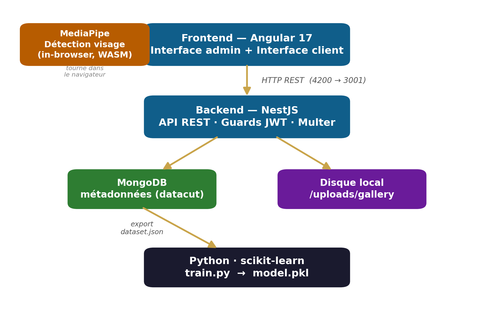
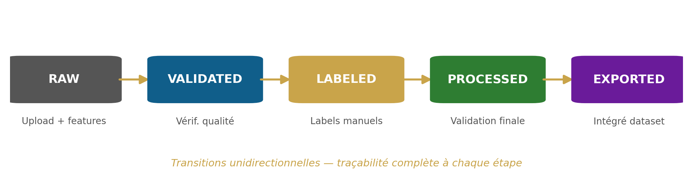

# DataCut — Symphonie des données en flux continu

Plateforme web de gestion du **cycle de vie complet des données** pour alimenter un
modèle d'IA : ingestion d'images → labélisation → versioning de datasets → entraînement.

> Projet fil rouge — Master 1 Intelligence Artificielle, École 89
> Étudiant : Amaury Guindon · Intervenant : Najib AL AWAR · 2025–2026

---

## Architecture



| Couche | Technologie | Rôle |
|---|---|---|
| Frontend | Angular 17 (standalone, signals) | Interface admin + client |
| Backend | NestJS + Mongoose | API REST, logique métier |
| Base de données | MongoDB (`datacut`) | Métadonnées |
| Stockage fichiers | Système de fichiers (multer) | Images brutes |
| Feature extraction | sharp (Node.js) | Caractéristiques à l'upload |
| ML entraînement | Python · scikit-learn | RandomForest multi-label |
| ML client | MediaPipe (WebAssembly) | Détection visage in-browser |

## Pipeline de données



`RAW → VALIDATED → LABELED → PROCESSED → EXPORTED` (transitions unidirectionnelles,
versioning par snapshots immuables).

## Structure du dépôt

```
DataCut/
├── src/                 # Frontend Angular (admin: pipeline, datasets, stats ; client: reco)
├── backend/             # API NestJS (gallery, dataset, stats, auth)
│   └── uploads/         # Fichiers images (hors git)
├── python/              # train.py, predict.py, model.pkl, requirements.txt
├── dataset create/      # Exemple de dataset versionné exporté (v1)
├── docs/                # Documentation technique
└── Livrables/           # Rapport (PDF/DOCX), présentation (PDF/PPTX), diagrammes
```

## Lancer le projet en local

Prérequis : Node.js 18+, MongoDB en local, Python 3.10+.

```bash
# Backend (port 3001)
cd backend && npm install && npm run start:dev

# Frontend (port 4200)
npm install && npm start

# Entraînement du modèle ML
cd python && pip install -r requirements.txt
py train.py "../dataset create/dataset-v1-2026-04-13.json"
```

## Livrables

- [`Livrables/Rapport_DataCut.pdf`](Livrables/Rapport_DataCut.pdf) — rapport technique complet
- [`Livrables/Presentation_DataCut.pdf`](Livrables/Presentation_DataCut.pdf) — support de soutenance
- [`Livrables/build_livrables.py`](Livrables/build_livrables.py) — script de génération (diagrammes + docs)
